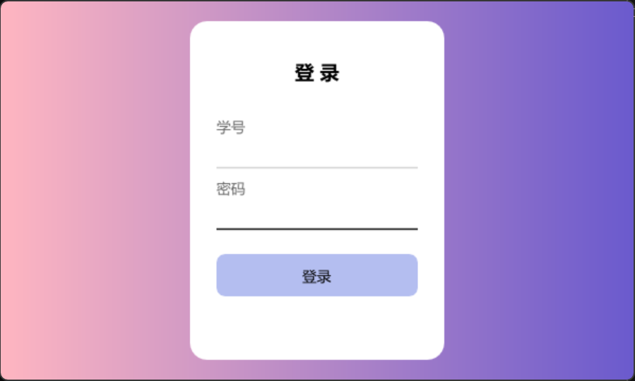
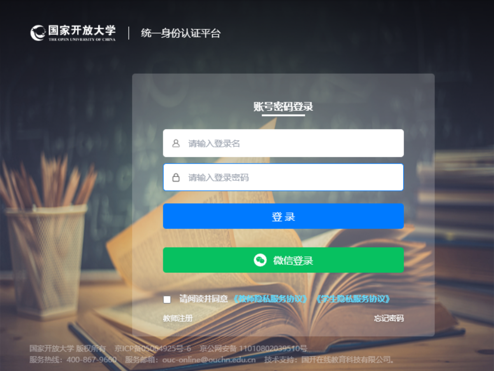
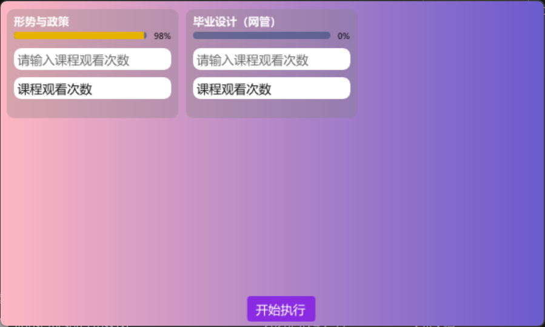

# OUCTool 使用说明

OUCTool 是一款用于国开课程刷取管理的 Windows 工具。  
本项目提供了简洁的界面，方便用户登录账号、配置课程刷取参数并开始执行任务。

## 下载地址

请前往以下地址下载 `OUCTool.exe`：

[OUCTool Releases 下载地址](https://github.com/drakmemory/OUCTool/releases/download/nightly/OUCTool.exe)

## 功能说明

- 支持账号密码登录
- 支持验证码场景下自动弹出浏览器进行登录
- 支持为每门课程设置刷取时长和次数
- 一键开始执行任务

## 使用步骤

### 1. 下载并运行程序

请先前往 **Releases** 页面下载 `OUCTool.exe`，下载完成后直接打开运行。
 
> 

### 2. 登录账号

打开 `OUCTool.exe` 后，请输入账号和密码完成登录。  
如果系统检测到需要验证码，程序会自动弹出浏览器，请在浏览器内完成登录操作。

> 

### 3. 配置课程刷取参数并开始执行

登录成功后，请为每一门课程填写需要刷取的时长和次数，确认无误后点击 **开始执行**。

> 这里可放置参数填写后的截图  
> 

## 注意事项

- 请确保网络连接正常。
- 登录信息请妥善保管，不要泄露给他人。
- 刷取参数请根据实际需求填写，避免填写错误。
- 如遇到登录异常或程序无法启动，请检查是否缺少运行环境或依赖。

## 常见问题

### 1. 程序打不开怎么办？

请确认已正确下载 `OUCTool.exe`，并检查系统是否拦截了程序运行。

### 2. 为什么会弹出浏览器？

当登录需要验证码时，程序会自动打开浏览器，用户需要在浏览器内完成验证。

### 3. 参数填写后没有反应怎么办？

请确认课程时长和次数填写正确，并检查网络状态是否正常。

---
